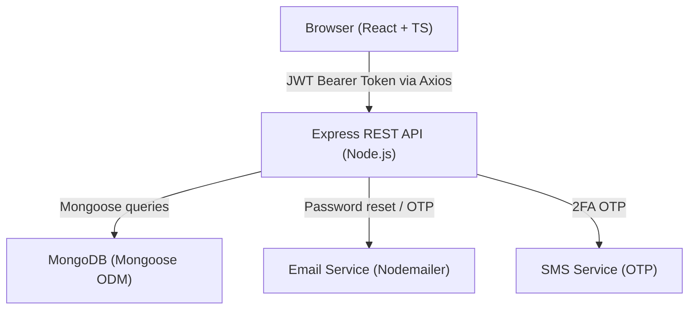
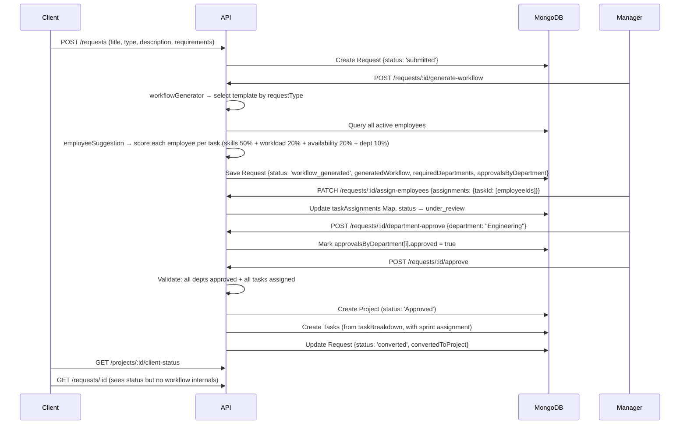

# Intelliflow — Deep Project Analysis

## 1. What Is Intelliflow?

Intelliflow is a **cross-functional workflow management platform** that turns client requests into structured projects, sprint plans, and actionable tasks across departments. It is a full-stack web app with a **Node.js/Express REST API backend** and a **React (Vite + TypeScript) frontend**.

---

## 2. High-Level Architecture



| Layer | Tech |
|---|---|
| Frontend | React 18 + TypeScript + Vite, React Router v6, TanStack Query, shadcn/ui, Tailwind CSS |
| Backend | Node.js + Express 4 |
| Database | MongoDB + Mongoose |
| Auth | JWT (stored in `localStorage`, sent via `Authorization: Bearer`) |
| 2FA / OTP | Email OTP or SMS OTP (via OTPService utility) |
| Security | Helmet, CORS, rate limiting, mongo-sanitize, xss-clean, HPP, bcrypt |

---

## 3. Repository Structure

```
Intelliflow/
├── Back End/
│   ├── app.js                     # Express app setup, all middleware
│   ├── server.js                  # HTTP server entry point
│   ├── config.env                 # Environment variables (gitignored)
│   ├── Controllers/
│   │   ├── authController.js      # Signup, login, 2FA, OTP, password reset
│   │   ├── employeeController.js  # Employee CRUD, profile, dashboard
│   │   ├── clientController.js    # Client CRUD, profile
│   │   ├── projectController.js   # Project CRUD, stats, sprint advance
│   │   ├── requestController.js   # Full request lifecycle + workflow engine
│   │   ├── taskController.js      # Task CRUD, reassign, "my tasks"
│   │   └── errorController.js     # Global error handler
│   ├── models/
│   │   ├── employeeModel.js       # Employee schema + auth methods
│   │   ├── clientModel.js         # Client schema + auth methods
│   │   ├── projectModel.js        # Project schema
│   │   ├── requestModel.js        # Request schema (workflow + approvals embedded)
│   │   └── taskModel.js           # Task schema
│   ├── routes/
│   │   ├── employeeRoutes.js
│   │   ├── clientRoutes.js
│   │   ├── requestRoutes.js
│   │   ├── projectRoutes.js
│   │   ├── taskRoutes.js
│   │   └── diagnosticRoutes.js    # Temporary email debugging
│   └── Utilities/
│       ├── workflowGenerator.js   # Rule-based template engine for workflow
│       ├── employeeSuggestion.js  # Scoring algorithm for employee matching
│       ├── projectStatusUpdater.js# Auto-complete project when all tasks done
│       ├── otp.js                 # OTP generation, hashing, SMS/email send
│       ├── email.js               # Nodemailer wrapper
│       ├── APIFeatures.js         # Filter/sort/paginate query builder
│       ├── appError.js            # Custom error class
│       └── catchAsync.js          # Async error wrapper
│
├── Front End/
│   ├── src/
│   │   ├── App.tsx                # Route definitions (all 3 portals)
│   │   ├── main.tsx               # React entry
│   │   ├── contexts/
│   │   │   └── UserContext.tsx    # Global auth state + login/logout
│   │   ├── lib/
│   │   │   ├── api.ts             # Axios instance + JWT interceptor
│   │   │   ├── mappers.ts         # API response → FE type mapping
│   │   │   ├── departments.ts     # Department constants
│   │   │   └── utils.ts           # Misc helpers
│   │   ├── pages/
│   │   │   ├── Login.tsx / Signup.tsx / ForgotPassword.tsx ...
│   │   │   ├── client/            # 7 client portal pages
│   │   │   ├── employee/          # 6 employee portal pages
│   │   │   └── manager/           # 10 manager portal pages
│   │   ├── components/
│   │   │   ├── common/            # ProtectedRoute, PortalLayout, etc.
│   │   │   ├── client/            # ClientSidebar
│   │   │   ├── employee/          # EmployeeSidebar
│   │   │   ├── manager/           # ManagerSidebar
│   │   │   ├── landing/           # Home/About page components
│   │   │   └── ui/                # shadcn/ui primitives
│   │   └── types/                 # TypeScript interfaces
│   └── vite.config.ts             # Proxy /api → backend
│
└── Data/
    ├── CSV data/                  # Seed CSVs
    └── JSON data/                 # Seed JSONs
```

---

## 4. Data Models — Schema Map

### Employee
| Field | Type | Notes |
|---|---|---|
| `employee_id` | Number | Unique numeric ID (used in task assignments) |
| `name`, `email` | String | Unique email |
| `role` | String | Free-form (but "manager"/"employee" are the key distinctions) |
| `department` | String | e.g. "Engineering", "Design", "QA" |
| `isApprover` | Boolean | Auto-set if role contains manager/lead/head |
| `approvesDepartments` | [String] | Departments this manager can approve for |
| `skills` | [String] | Used for employee suggestion matching |
| `availability` | Enum: Available/Busy/On Leave | |
| `phone`, `phoneVerified` | String/Boolean | Required for SMS 2FA |
| `emailVerified` | Boolean | Required for email 2FA |
| `twoFactorEnabled`, `twoFactorMethod` | Boolean/Enum | sms or email |
| `otpCode`, `otpExpires`, `otpAttempts`, `otpLastSent` | Various | OTP lifecycle fields |
| `password`, `passwordChangedAt`, `passwordResetToken` | Various | Auth fields (bcrypt, select: false) |
| `active` | Boolean | Soft-delete flag (filtered via `pre(/^find/)`) |

### Client
Mirrors Employee's auth fields but with `client_id`, `client_name`, `contact_email`, `industry`, `address`.

### Request (Core entity — most complex)
| Field | Type | Notes |
|---|---|---|
| `client` | ObjectId → Client | Who submitted it |
| `requestType` | Enum: web_dev/app_dev/prototype/research | Drives workflow template selection |
| `title`, `description`, `requirements` | String/[String] | |
| `requiredDepartments` | [String] | Derived from workflow task teams |
| `approvalsByDepartment` | [Embedded] | Per-dept: approved/rejected, by whom, when |
| `generatedWorkflow` | Embedded | estimatedDuration + taskBreakdown (with skills, team, suggestedEmployees) |
| `taskAssignments` | Map<taskId → [ObjectId]> | Separate to prevent data loss during workflow updates |
| `status` | Enum | submitted → workflow_generated → under_review → approved/rejected → converted |
| `convertedToProject` | ObjectId → Project | Set after approval creates project |

### Project
| Field | Notes |
|---|---|
| `project_id` | Numeric (Date.now() at creation) |
| `project_title`, `category`, `framework`, `status`, `requirements` | Standard |
| `client`, `client_name` | Reference + denormalized name |
| `activeSprintNumber`, `totalSprints` | Sprint management |

### Task
| Field | Notes |
|---|---|
| `task_id` | Numeric |
| `task_name`, `description`, `priority`, `status`, `dueDate` | Standard |
| `project` | ObjectId → Project |
| `sprint`, `sprint_number` | String label + numeric (for ordering/filtering) |
| `assigned_to` | [Number] — employee_id values (NOT ObjectIds!) |
| `dependencies` | [Number] — task_id values |

> **Key Design Note:** Tasks use numeric `employee_id` for assignments (not `_id` ObjectIds). This causes a lookup step when enriching task data with employee details.

---

## 5. The Core Lifecycle: Request → Project (Critical Flow)



---

## 6. Workflow Generation Engine

**File:** `Back End/Utilities/workflowGenerator.js`

Currently **rule-based / template-driven** (with a `// TODO: Replace with AI model integration` comment).

### 4 Templates:
| Type | Est. Hours | Tasks |
|---|---|---|
| `web_dev` | 320h | Requirements Analysis, UI/UX Design, Frontend Dev, Backend Dev, Testing & QA |
| `app_dev` | 400h | Requirements Analysis, UI/UX Design, Mobile App Dev, Backend API Dev, Testing & QA |
| `prototype` | 120h | Requirement Gathering, Prototype Design, Interactive Prototype Dev |
| `research` | 80h | Research & Analysis |

Each task has: `taskName`, `team` (department), `estimatedHours`, `requiredSkills[]`.

---

## 7. Employee Suggestion Algorithm

**File:** `Back End/Utilities/employeeSuggestion.js`

Scores each active employee per task (max 100 points):

| Factor | Weight | Logic |
|---|---|---|
| Skill match | 50% | `matchingSkills/requiredSkills * 50` |
| Workload | 20% | 0 pending→20, ≤2→15, ≤5→10, else→5 |
| Availability | 20% | Available→20, Busy→8, On Leave→0 |
| Dept match | 10% | Partial string match on department vs task.team |

Returns **top 3** employees per task. Manager can override these suggestions by using `assign-employees`.

---

## 8. Security Architecture

| Layer | Implementation |
|---|---|
| **Headers** | `helmet()` — sets X-Frame-Options, Content-Security-Policy, etc. |
| **CORS** | Only `FRONTEND_URL` env var is whitelisted |
| **Rate Limiting** | 100 req/hr general; 5 req/15min auth endpoints (50 in dev) |
| **NoSQL Injection** | `express-mongo-sanitize` — strips `$` and `.` from inputs |
| **XSS** | `xss-clean` — strips script tags from body |
| **Param Pollution** | `hpp` — blocks duplicate query params |
| **Body Size** | 10kb JSON limit |
| **JWT** | HS256, stored in localStorage, sent via `Authorization: Bearer` |
| **Password** | bcrypt cost 10, `select: false`, never returned |
| **Password Reset** | `crypto.randomBytes(32)`, SHA-256 hashed before DB storage |
| **Token Invalidation** | `changedPasswordAfter()` compares JWT `iat` vs `passwordChangedAt` |
| **OTP** | SHA-256 hashed before DB storage, 3 attempt limit, rate-limited |
| **2FA** | Optional per user (SMS or email OTP), checked at login |
| **Soft Delete** | `active: false` + `pre(/^find/)` filter — employees never hard deleted |

---

## 9. Role-Based Access Control (RBAC)

Three user types, each with a completely separate portal:

| Role | Portal Path | Key Capabilities |
|---|---|---|
| **client** | `/client/*` | Submit requests, view own requests (no workflow internals), view own projects (task summary only, no employee details) |
| **employee** | `/employee/*` | View "My Tasks", update task status, view own projects, see team members |
| **manager** | `/manager/*` | Full request lifecycle, workflow generation, employee assignment, department approval, sprint advance, manage employees/clients, full project visibility |

**Department Scoping for Managers:**
- `approvesDepartments[]` controls which departments a manager can approve and assign tasks for.
- `expandAliases()` handles synonyms (e.g., "QA" ≡ "Testing", "Engineering" ≡ "Development").
- A manager can only advance a sprint if they manage at least one department in the current sprint's tasks.

---

## 10. Frontend Architecture

### Routing (`App.tsx`)
- React Router v6 with `<ProtectedRoute allowedRole="...">` guard
- Each portal wrapped in `<PortalLayout sidebar={<XxxSidebar/>}>` 
- `<ProtectedRoute>` reads `userRole` from `UserContext` and redirects if unauthorized

### Auth State (`UserContext.tsx`)
- Global React Context holding: `employee`, `userRole`, `token`, `loading`
- Token stored in `localStorage`, hydrated on mount
- On mount: validates existing token against `/me` endpoint (clears if 401/403)
- Cross-tab sync: `window.addEventListener('storage')` detects logout/login in other tabs
- `loginEmployee()` → maps API user → `Employee` type → sets role ('manager' or 'employee')
- `loginClient()` → sets role 'client' (no employee profile)

### API Client (`lib/api.ts`)
- Axios instance with `baseURL = VITE_API_BASE_URL || '/api/v1'`
- Request interceptor: attaches `Authorization: Bearer <token>` from localStorage (skips for login/public endpoints)
- Response interceptor: normalizes `ERR_NETWORK` and timeout errors
- 40s timeout (handles backend cold starts on Render)

### Pages by Portal

**Client Portal (7 pages):**
- `Dashboard` — overview cards, recent requests
- `Projects` — list of converted projects
- `ProjectDetails` — task summary (no employee names), progress stats
- `SubmitRequest` — form to create a new request
- `MyRequests` — list of all own requests
- `RequestDetails` — view request status (workflow hidden)
- `Profile` — account management, 2FA settings

**Employee Portal (6 pages):**
- `Dashboard` — task stats, upcoming work
- `Tasks` — all assigned tasks with status update capability
- `MyProjects` — projects employee is part of
- `MyProjectDetails` — full task list for a project
- `Team` — view department colleagues
- `Profile` — account, 2FA settings

**Manager Portal (10 pages):**
- `Dashboard` — org-wide stats
- `Projects` — all projects
- `ProjectDetails` — full task list with employee details, sprint advance
- `Requests` — all requests in pipeline
- `RequestDetails` — **most complex page** (30KB): generate workflow, view suggestions, assign employees, dept approve, final approve → triggers project creation
- `Team` — all employees
- `ManageEmployees` — add/edit/disable employees
- `AddClient` — onboard new client
- `Profile` — account, 2FA, approves departments settings

---

## 11. Key Interconnections (Dependency Map)

```
requestController.approveRequest()
    ├─ Creates → Project (projectModel)
    ├─ Creates → Tasks[] (taskModel) from generatedWorkflow.taskBreakdown
    │       ├─ Looks up Employee._id → employee_id for assigned_to[]
    │       ├─ Assigns sprint = Sprint N (every 2 tasks = 1 sprint)
    │       └─ Sets sequential dependencies (task[i] depends on task[i-1])
    └─ Updates → Request.status = 'converted', convertedToProject = project._id

taskController.updateTaskStatus() / updateTask()
    └─ Calls → projectStatusUpdater.updateProjectStatusIfComplete()
            └─ If ALL tasks Done/Completed → Project.status = 'Completed'

projectController.advanceSprint()
    ├─ Validates all current sprint tasks are Done/Completed
    ├─ Checks manager's approvesDepartments matches sprint employee depts
    └─ project.activeSprintNumber += 1; if > totalSprints → 'Completed'

workflowGenerator.generateWorkflowWithSuggestions()
    └─ Calls → employeeSuggestion.suggestEmployeesForTask() per task
            ├─ Employee.find({ active: true })
            └─ Task.countDocuments({ assigned_to: empId, status: [active] })
```

---

## 12. Identified Gaps, Tech Debt & Opportunities

> [!WARNING]
> **Task Assignment Design Inconsistency:** Tasks store assignments as `assigned_to: [Number]` (employee_id), but Requests store `taskAssignments` as `Map<taskId → [ObjectId]>`. This means a lookup step is always needed to bridge the two, and the `employeeSuggestion.js` workload query checks both `assignedTo` and `assigned_to` fields (both exist on the model — `assignedTo` appears to be a legacy alias).

> [!WARNING]
> **No Real-Time Updates:** The frontend uses polling or manual refresh. There is no WebSocket/SSE layer. If a manager assigns a task, the employee won't see it until they refresh.

> [!NOTE]
> **Rule-Based Workflow Engine (Hardcoded Templates):** The `workflowGenerator.js` has a `// TODO: Replace with AI model integration` comment. Only 4 project types exist, each with a fixed task list. This is the primary limitation for the "Intelligent Automation" roadmap item.

> [!NOTE]
> **Sprint Assignment is Simplistic:** Tasks are assigned to sprints by index — every 2 tasks get the same sprint number (`Math.floor(index / 2) + 1`). No effort estimation or dependency analysis is used.

> [!NOTE]
> **Department Alias System is Fragile:** The `ALIASES` map in `requestController.js` and the `normalizeDept()` function must be manually kept in sync with the frontend `departments.ts` file. A shared canonical enum would be safer.

> [!TIP]
> **Analytics hooks exist** (`getProjectStats`, `getTaskStats`) but the frontend dashboard appears to use its own API calls. These aggregate endpoints could power richer analytics pages.

> [!TIP]
> **`active` soft-delete on employees** is properly implemented via Mongoose `pre(/^find/)` middleware, but there is no equivalent for projects or tasks (hard-deleted with `findByIdAndDelete`).

> [!CAUTION]
> **Phone Uniqueness disabled:** Both `employeeModel.js` and `clientModel.js` have `// unique: true // DISABLED FOR TESTING`. This should be enabled in production to prevent account confusion.

> [!CAUTION]
> **`client.password` has a default value of `'password123'`** in `clientModel.js`. This is a critical security risk for any client records seeded without an explicit password.

---

## 13. Data Flow Summary

```
Client submits → [Request: status=submitted]
Manager generates workflow → [Request: status=workflow_generated] + suggestedEmployees scored
Manager assigns employees → [Request: status=under_review] + taskAssignments Map updated
Manager dept-approves (each dept) → [approvalsByDepartment[i].approved = true]
Manager final-approves → [Project created] + [Tasks created] + [Request: status=converted]
Employee updates task status → [Task.status = Done] → [Project auto-completes if all done]
Manager advances sprint → [Project.activeSprintNumber++] → [Project.status = Completed if final]
```

---

## 14. API Endpoint Reference

| Method | Endpoint | Auth | Role |
|---|---|---|---|
| POST | `/api/v1/employees/signup` | None | — |
| POST | `/api/v1/employees/login` | None | — |
| POST | `/api/v1/employees/forgotPassword` | None | — |
| POST | `/api/v1/employees/verify-reset-otp` | None | — |
| POST | `/api/v1/employees/verify-login-otp` | None | — |
| PATCH | `/api/v1/employees/resetPassword/:token` | None | — |
| GET | `/api/v1/employees/me` | JWT | any |
| GET | `/api/v1/employees/me/dashboard` | JWT | employee/manager |
| GET | `/api/v1/employees/me/projects` | JWT | employee/manager |
| PATCH | `/api/v1/employees/updateMe` | JWT | any |
| GET | `/api/v1/employees` | JWT | any |
| GET/PATCH/DELETE | `/api/v1/employees/:id` | JWT | manager (delete) |
| POST | `/api/v1/clients/signup` | None | — |
| POST | `/api/v1/clients/login` | None | — |
| GET | `/api/v1/requests/my-requests` | JWT | client |
| GET/POST | `/api/v1/requests` | JWT | all |
| GET/PATCH/DELETE | `/api/v1/requests/:id` | JWT | owner/manager |
| POST | `/api/v1/requests/:id/generate-workflow` | JWT | any |
| PATCH | `/api/v1/requests/:id/assign-employees` | JWT | manager |
| POST | `/api/v1/requests/:id/department-approve` | JWT | manager |
| POST | `/api/v1/requests/:id/department-reject` | JWT | manager |
| POST | `/api/v1/requests/:id/approve` | JWT | manager |
| GET | `/api/v1/projects` | JWT | any |
| GET | `/api/v1/projects/:id` | JWT | any |
| GET | `/api/v1/projects/:id/client-status` | JWT | client/manager |
| POST | `/api/v1/projects/:id/advance-sprint` | JWT | manager |
| GET | `/api/v1/tasks/my-tasks` | JWT | employee |
| PATCH | `/api/v1/tasks/:id/status` | JWT | any |
| PATCH | `/api/v1/tasks/:id/reassign` | JWT | manager |
